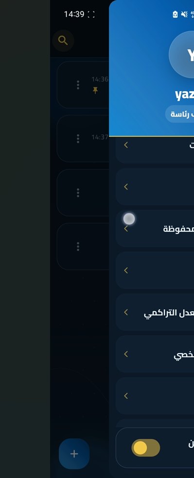
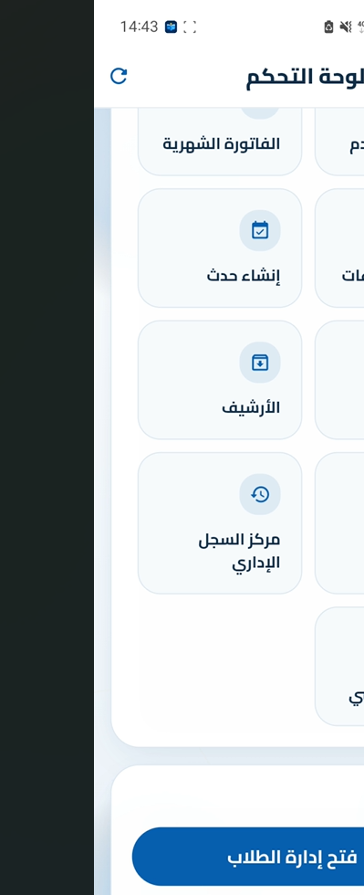
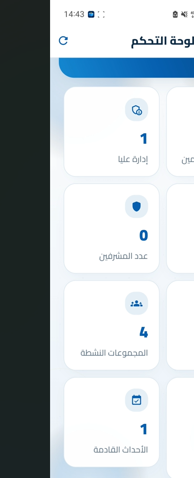
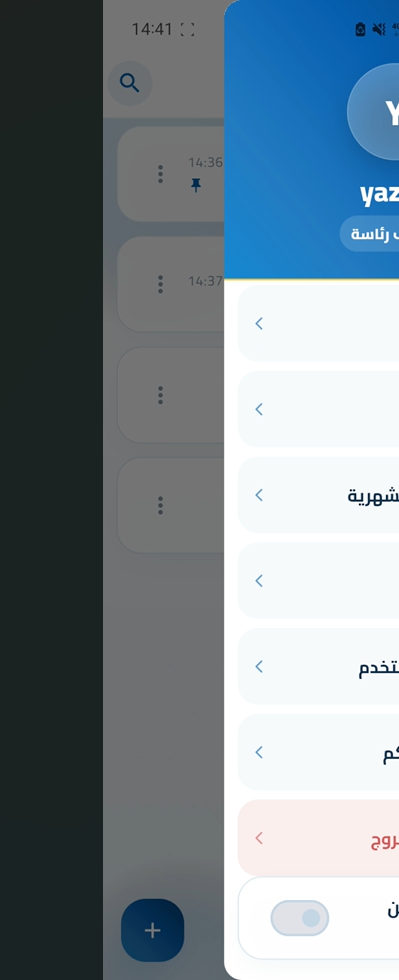

# Alwatanya Chat

<p align="center">
  
</p>

<h3 align="center">University Communication & Group Chat Application</h3>

<p align="center">
  Flutter • Firebase • Firestore • Cloud Functions • Firebase Storage
</p>

<p align="center">
  <a href="https://github.com/yazannasr288">GitHub</a>
</p>

---

## Overview

**Alwatanya Chat** is a university communication and group chat application built with Flutter and Firebase.

The application is designed around university communities, departments, and managed groups. It provides role-based access, real-time messaging, media and file sharing, notifications, group management, administrative tools, secure session handling, and additional communication features.

The system combines a Flutter mobile application with Firebase Authentication, Cloud Firestore, Firebase Storage, Firebase Cloud Messaging, and a collection of Cloud Functions responsible for server-side operations and administrative workflows.

---

## Key Features

### Authentication & Security

- Email-based authentication
- Role-based access control
- Multiple administrative roles
- Secure session management
- Application PIN lock
- Temporary password / PIN management
- Forced credential change flows
- Account freeze and restore workflows
- Secure local credential/session storage

### Groups & Communication

- University group management
- Department-based groups
- Group membership management
- Real-time chat
- Message read state
- Message forwarding
- Saved messages
- Archived groups/messages
- Group search
- Managed groups and restricted groups

### Messaging Features

- Text messages
- Image sharing
- Video sharing
- File sharing
- Camera attachments
- Audio recording / playback
- Poll creation
- Poll interaction
- Message forwarding
- Media previews
- Message notifications

### Notifications

- Firebase Cloud Messaging
- Push notifications
- Local notifications
- Group notifications
- Managed notification campaigns
- Event reminders

### Events & University Utilities

- University events
- Event creation and management
- Event interest tracking
- Event reminders
- University portal integration
- Additional student-oriented utilities

### Administration

The application contains a dedicated administrative dashboard for managing the platform.

Administrative functionality includes:

- Dashboard statistics
- User management
- Managed user profiles
- Group management
- Managed group members
- Add/remove group members
- Group archiving and restoration
- Account freezing and restoration
- User credential reset
- Notification campaigns
- Event management
- Audit logs
- Administrative search
- Student management

---

## User Roles

The application uses role-based permissions.

```text
                    ┌──────────────────────┐
                    │      Firebase        │
                    │ Authentication       │
                    └──────────┬───────────┘
                               │
                    ┌──────────▼───────────┐
                    │    Role-Based Access │
                    └──────────┬───────────┘
                               │
       ┌───────────────────────┼────────────────────────┐
       │                       │                        │
       ▼                       ▼                        ▼
    User                    Admin                    Admin0
       │                       │                        │
       │                       │                        │
       ▼                       ▼                        ▼
   Groups & Chat        Managed Features          Full Management
```

The project includes multiple administrative levels such as:

```text
admin0
admin1
admin2
user
```

The exact permissions are enforced by the application logic and Firebase backend.

---

## System Architecture

```text
                         ┌──────────────────────────┐
                         │       Flutter App        │
                         │                          │
                         │ Authentication           │
                         │ Groups & Chat             │
                         │ Notifications             │
                         │ Admin Dashboard           │
                         └────────────┬─────────────┘
                                      │
                   ┌──────────────────┼──────────────────┐
                   │                  │                  │
                   ▼                  ▼                  ▼
          ┌────────────────┐ ┌────────────────┐ ┌────────────────┐
          │ Firebase Auth  │ │ Cloud Firestore│ │ Firebase       │
          │                │ │                │ │ Storage        │
          │ User Identity  │ │ Users          │ │ Images         │
          │ Sessions       │ │ Groups         │ │ Videos         │
          │ Authentication │ │ Messages       │ │ Files          │
          └────────────────┘ │ Events         │ └────────────────┘
                             └────────┬───────┘
                                      │
                                      ▼
                             ┌──────────────────┐
                             │ Cloud Functions  │
                             │                  │
                             │ Admin workflows  │
                             │ Group operations │
                             │ Events           │
                             │ Notifications    │
                             │ Secure actions   │
                             └──────────────────┘
                                      │
                                      ▼
                             ┌──────────────────┐
                             │ Firebase Cloud   │
                             │ Messaging (FCM)  │
                             └──────────────────┘
```

---

# Screenshots

## Login & Application Security

| Login | PIN Lock |
|---|---|
|  |  |

---

## Groups & Real-Time Chat

| Groups Home | Chat |
|---|---|
|  |  |

---

## Communication Features

| Attachments | Poll Creation | Message Forwarding |
|---|---|---|
|  |  |  |

---

## Administration

| Admin Sidebar | Admin Dashboard |
|---|---|
|  |  |

| Dashboard Statistics | Admin Controls |
|---|---|
|  |  |

---

# Technology Stack

## Mobile Application

- Flutter
- Dart
- Firebase Core
- Firebase Authentication
- Cloud Firestore
- Firebase Storage
- Firebase Cloud Messaging
- Cloud Functions
- Flutter Local Notifications
- Flutter Secure Storage
- Shared Preferences
- Hive
- Easy Localization
- Video Player
- Audio Recording & Playback
- File Picker
- Image Picker
- Cached Network Image
- WebView
- URL Launcher
- Device Information
- Crypto
- UUID

## Backend / Serverless

- Firebase Cloud Functions
- TypeScript
- Node.js
- Firebase Admin SDK
- Firestore
- Firebase Storage
- Firebase Cloud Messaging

---

# Cloud Functions

The backend contains a large set of Cloud Functions organized by responsibility.

```text
functions/
├── src/
│   ├── config/
│   ├── constants.ts
│   ├── dashboard/
│   ├── events/
│   └── functions/
```

Important backend areas include:

### Dashboard

- User management
- Group management
- Credential reset
- Account freeze / restore
- Audit logs
- Notification campaigns
- Dashboard statistics

### Groups

- Safe group creation
- Group deletion
- Member management
- Message deletion
- Message forwarding
- Group listing
- Read-state management
- Attachment URL handling

### Events

- Event creation
- Event editing
- Event cancellation
- Event visibility
- Event reminders
- Event interest tracking

### Sessions

- Secure session handling
- Session cleanup
- User session management

---

# Firebase Security

Security-sensitive values are intentionally kept outside the public repository.

Examples include:

- Firebase local configuration
- API-specific local configuration
- Service account credentials
- Private keys
- Environment files
- Runtime secrets

Cloud Functions use Firebase Secret Manager references instead of storing sensitive values directly in source code.

The project includes:

```text
firestore.rules
storage.rules
```

for Firebase Security Rules.

Runtime secrets used by backend operations include references such as:

```text
PIN_PEPPER
BULK_IMPORT_AES_KEY_B64
```

The actual secret values are not stored in the repository.

---

# Project Structure

```text
university-chat-app/
│
├── android/                    # Android platform files
├── ios/                        # iOS platform files
├── lib/                        # Flutter application source
├── assets/                     # Images, fonts, translations, branding
│
├── functions/                  # Firebase Cloud Functions
│   └── src/
│       ├── config/
│       ├── dashboard/
│       ├── events/
│       └── functions/
│
├── screenshots/                # Portfolio screenshots
│
├── firestore.rules             # Firestore Security Rules
├── storage.rules               # Firebase Storage Rules
├── firestore.indexes.json      # Firestore indexes
├── firebase.json               # Firebase configuration
├── .firebaserc                 # Firebase project configuration
├── pubspec.yaml                # Flutter dependencies
├── package.json                # Root Node configuration
├── README.md
├── LICENSE
└── .gitignore
```

---

# Firebase Configuration

For security reasons, local Firebase configuration files are not included in the public repository.

Examples include:

```text
lib/firebase_options.dart
android/app/google-services.json
ios/Runner/GoogleService-Info.plist
```

To run the project with your own Firebase environment, create and configure your own Firebase project and generate the required platform configuration.

The application requires Firebase services such as:

- Firebase Authentication
- Cloud Firestore
- Firebase Storage
- Firebase Cloud Messaging
- Cloud Functions

---

# Getting Started

## 1. Clone the Repository

```bash
git clone https://github.com/yazannasr288/university-chat-app.git
cd university-chat-app
```

## 2. Install Flutter Dependencies

```bash
flutter pub get
```

## 3. Configure Firebase

Create your own Firebase project and configure the required Firebase services.

Generate the Flutter Firebase configuration using FlutterFire CLI.

Example:

```bash
flutterfire configure
```

## 4. Configure Cloud Functions

Go to:

```bash
cd functions
```

Install dependencies:

```bash
npm install
```

Build the functions:

```bash
npm run build
```

## 5. Run the Application

Return to the project root:

```bash
cd ..
flutter run
```

---

# Development Notes

The application is structured around a Flutter client with Firebase-backed services.

The backend uses Cloud Functions for server-side workflows that should not be executed directly from the client.

Sensitive runtime configuration is intentionally kept outside source control.

---

# Security Practices

This project follows several security-oriented practices:

- Role-based authorization
- Firestore Security Rules
- Storage Security Rules
- Cloud Functions for privileged operations
- Server-side administrative workflows
- Runtime secret management
- Secure local session storage
- Application PIN protection
- Temporary credential workflows
- Account freezing and restoration
- Audit logging

---

# Future Improvements

Possible future improvements include:

- Automated CI/CD
- Expanded testing coverage
- Additional administrative analytics
- More advanced moderation tools
- Additional university integrations
- Broader deployment automation

---

# Author

## Yazan Nasr

**Computer Engineer | Flutter & Full-Stack Developer**

GitHub:

https://github.com/yazannasr288

---

## License

This project is licensed under the MIT License.
See the `LICENSE` file for details.